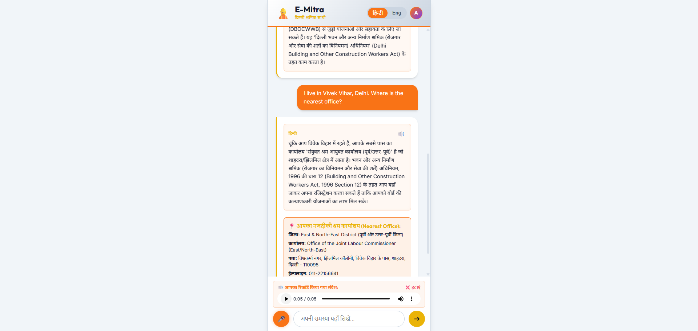
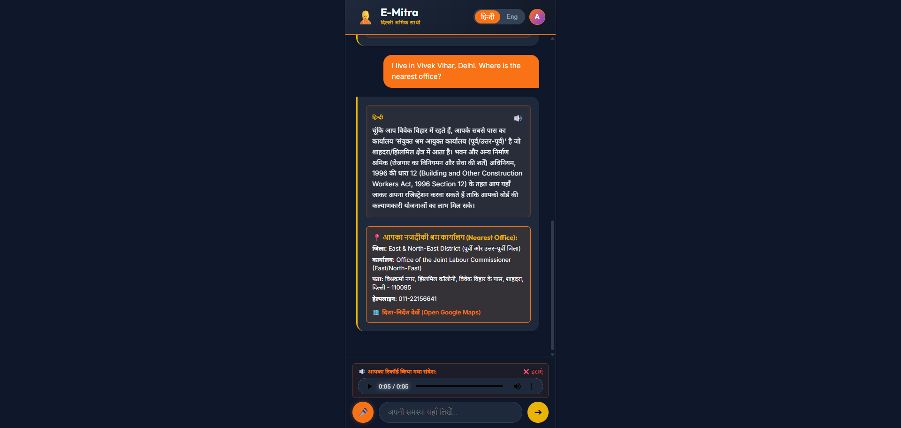

# E-Mitra (ई-मित्र) — Delhi Migrant Worker & Labour Right Agent

E-Mitra is a bilingual, voice-first, highly secure web application built to empower migrant workers and labourers in Delhi. By translating complex legalese into plain, conversational Hindi and English, and employing hybrid semantic vector search via **Elasticsearch** and **Google Gemini 2.5 Flash**, E-Mitra allows workers to speak or type rights questions, find minimum wages, access welfare schemes (like e-Shram), and route themselves to their nearest District Labour Commissioner office.

## 📸 Screenshots

| Light Mode (Voice Preview & Office Card) | Dark Mode (Voice Preview & Office Card) |
| :---: | :---: |
|  |  |

---

## 🏆 Evaluation Parameters & Impact

E-Mitra is designed to excel across all core parameters:

### 1. Real World Impact and Relevance
Migrant workers face massive barriers: language, digital literacy, and information asymmetry. E-Mitra solves this by providing a **Voice-First** interface. A worker can speak their problem in conversational Hindi (e.g., *"Contractor hasn't paid me"*). E-Mitra responds in empathetic, plain Hindi for understanding, while simultaneously providing the exact legal English statute (e.g., *Payment of Wages Act 1936*) so the worker has actionable proof to show authorities.

### 2. Actionability and Security (Defense in Depth)
- **Actionability**: Information without direction is useless. E-Mitra requests geolocation and **routes the worker to the exact physical address** of the nearest District Labour Commissioner in Delhi via Google Maps.
- **Security & Guardrails**: 
  - **AI Safety & Prompt Injection**: Inputs are sanitized (`safeQuery`) and strictly isolated from system prompts to block prompt-injection attacks.
  - **API & Endpoint Security**: The `/api/route-office` endpoint enforces strict Zod schema validation (restricting lat/lon ranges). `helmet` middleware sets secure HTTP headers (XSS protection, etc.).
  - **DDoS & Resource Protection**: Incoming requests are capped with `express.json({ limit: '10kb' })` to prevent massive payload attacks, and `express-rate-limit` throttles brute-force attempts.
  - **Application Reliability**: All Gemini API calls use `AbortController` timeouts (15s/10s) to prevent indefinite hangs. Frontend race conditions are mitigated by aborting stale in-flight requests.
  - **UX Safety (Global Kill Switch)**: Audio playback halts immediately on user interruption (new queries or language toggles) to prevent chaotic overlapping audio.
### 3. Elastic Usage (Search & Audit)
- **Hybrid Semantic Search**: Uses `dense_vector` (3072 dimensions) with Gemini embeddings for semantic matching (Cosine Similarity), falling back to `multi_match` BM25 keyword search across titles and descriptions.
- **Geo-Routing**: Uses Elasticsearch `geo_point` mapping to calculate nearest locations based on user coordinates.
- **HNSW Tuning**: Tuned index options (`m: 16`, `ef_construction: 100`) for maximum vector recall.
- **Audit Logging**: Every query, latency metric, and detected language is fire-and-forget logged into an `emitra-audit-logs` Elastic index for real-time Kibana monitoring.

### 4. Data Effort
A curated dataset of Delhi Minimum Wages, Labour Statutes (Maternity Benefit Act, Payment of Wages, Factories Act), and Welfare Schemes (e-Shram, BOCW) was structured into JSON fixtures and embedded using a high-performance Python ingestion script via the Elastic `helpers.bulk()` API (yielding 10x faster indexing).

### 5. Demo Quality and Storytelling
E-Mitra is packaged as a **Progressive Web App (PWA)** experience with fixed headers/footers, inner scrolling, and dynamic bilingual panels. The UX is polished with loading skeletons, undo/edit buttons, and pulsating microphone animations.

---

## 🚀 Use Cases & Examples

1. **Minimum Wages Assessment**: 
   - *Query*: "What is the minimum wage for a skilled worker in Delhi?"
   - *Action*: Fetches the latest officially gazetted wage rates (monthly and daily).
2. **Wage Theft & Rights Violations**:
   - *Query*: "My contractor hasn't paid me for 3 weeks."
   - *Action*: Explains rights under the Payment of Wages Act and tells them how to file a complaint.
3. **Welfare Board Access (e-Shram)**:
   - *Query*: "How do I register for the e-Shram portal?"
   - *Action*: Simplifies the eligibility criteria and required documents into bullet points.
4. **Physical Routing**:
   - *Action*: Clicking "Find Nearest Labour Office" uses device GPS to plot a route to the closest Labour Commissioner.

---

## ⚡ Technical Details & Optimizations

**Tech Stack**: React + Vite (Frontend), Node.js + Express (Backend), Python (Ingestion), Elasticsearch (Vector DB), Google Gemini API (LLM/Embeddings).

**Performance Optimizations**:
- **Fire-and-Forget Auditing**: Audit logs are dispatched asynchronously without `await`, shaving 50-150ms off the user's response time.
- **Payload Compression**: Enabled `compression` middleware, shrinking JSON payloads by ~60-70% over the wire.
- **ES `_source` Filtering**: Excludes the massive 3072-dimensional `text_vector` from Elasticsearch search responses, saving ~72KB per request.
- **Data Caching**: Fallback JSON fixtures are cached in memory at module load, eliminating disk I/O during fallback scenarios.
- **React Memoization**: Reduced re-renders in the chat interface.

---

## 🏗️ Project Structure
```text
Elastic-Buildathon/
├── backend/                  # Node.js / Express security backend
│   ├── db.js                 # Elasticsearch connectivity & audit logging
│   ├── gemini.js             # Google Gemini API REST client & timeouts
│   ├── server.js             # API endpoints, Zod validation, rate-limiting
│   └── package.json
├── data/
│   └── data_fixtures.json    # Statutes, wages, welfare schemes & offices
├── frontend/                 # Vite + React Web Application (PWA UI)
│   ├── src/
│   │   ├── App.jsx           # Main React code (Speech API, Geo-routing, Guardrails)
│   │   └── index.css         # Worker Safety high-contrast theme styling
│   └── package.json
├── scripts/
│   └── ingest.py             # Bulk vector embedding & Elastic ingestion
├── requirements.txt          # Python dependencies
└── .env                      # Credentials file
```

---

## ⚡ Prerequisites
- **Node.js** (v18 or higher)
- **Python 3**
- An **Elastic Cloud Account** (14-day free trial supports vectors)
- A **Google Gemini API Key** (from [Google AI Studio](https://aistudio.google.com/))

---

## 🚀 Quick Start Guide

### Step 1: Configure Environment Variables
Copy `.env.example` to a new file named `.env` in the root folder, and fill in your keys:
```env
ELASTIC_CLOUD_ID=your_elastic_cloud_id
ELASTIC_API_KEY=your_elastic_api_key
GEMINI_API_KEY=your_gemini_api_key
JWT_SECRET=emitra-super-secret-key-2026
```

### Step 2: Index Data into Elasticsearch
```bash
pip install -r requirements.txt
python scripts/ingest.py
```

### Step 3: Start the Backend Server
```bash
cd backend
npm install
npm start
```
*Server runs on `http://localhost:5000`.*

### Step 4: Start the Frontend Application
```bash
cd frontend
npm install
npm run dev
```
*Open `http://localhost:5173` in Google Chrome (for optimal Web Speech API voice support).*

---

## 🕵️ Demo & Storytelling Guide
1. **Quick Login:** Open the web app and click **✨ Demo Quick Login** (Admin user).
2. **Voice Query:** Tap the microphone 🎤 button and speak in Hindi (e.g., *"ठेकेदार ने 3 हफ्ते से पैसे नहीं दिए"*).
3. **Bilingual RAG Answer:** Notice the response appears in Hindi (for the worker) and English (with exact legal citations).
4. **Audio Synthesis:** Click the Speaker 🔊 icon to hear E-Mitra speak the rights out loud. Notice how clicking it again or sending a new message instantly kills the audio (Guardrails).
5. **Location Routing:** Scroll down and view the routing card pointing to the closest Labour Commissioner Office, with a Google Maps button.
6. **Kibana Audit:** Open Kibana and view the `emitra-audit-logs` to show judges the real-time stream of incoming queries and performance metrics.
