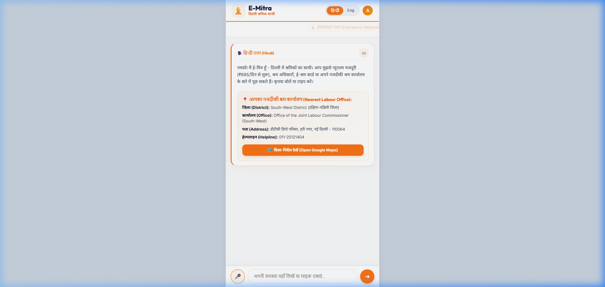
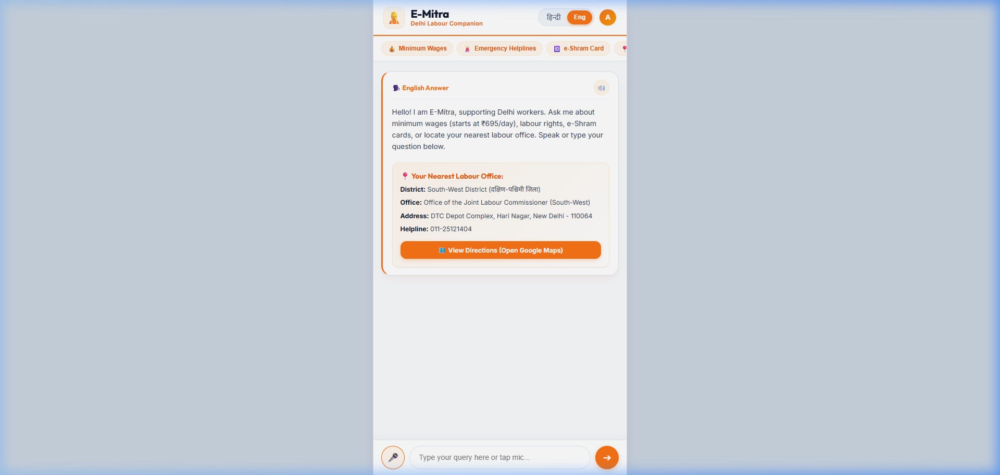
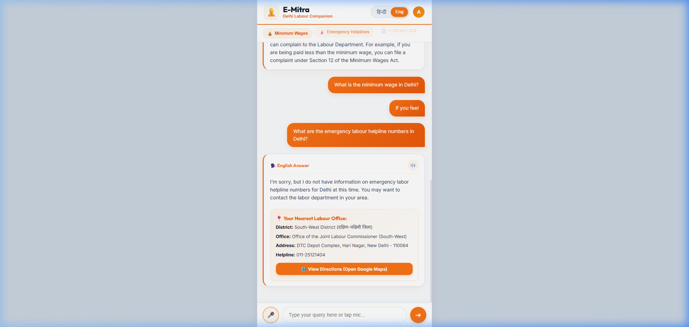
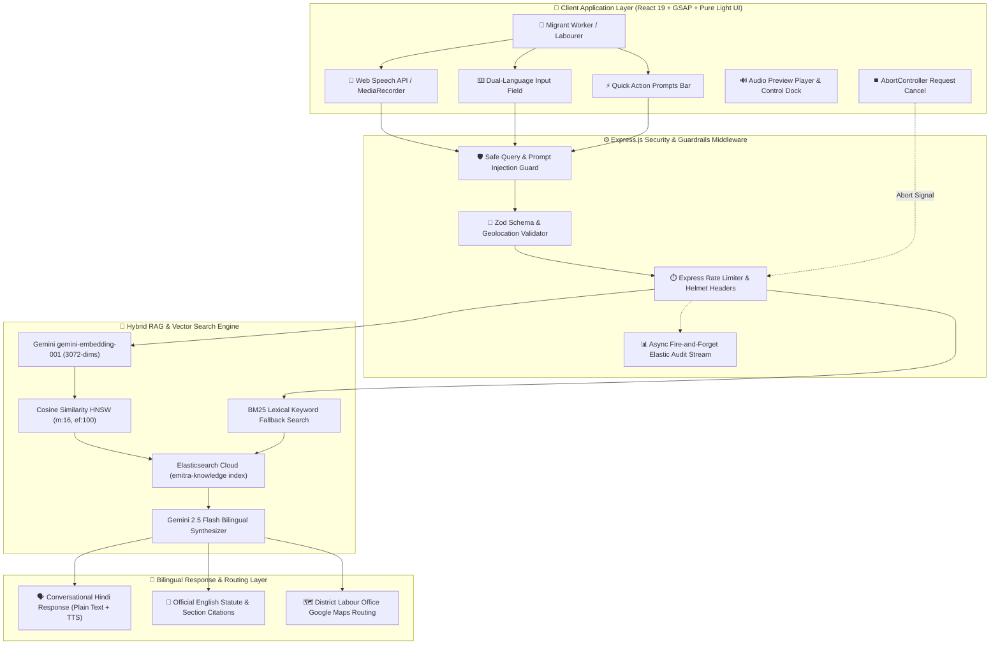
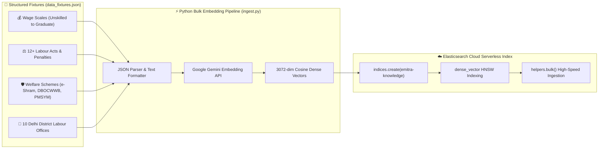

# E-Mitra (ई-मित्र) — Delhi Labour Rights & Migrant Worker AI Agent

<div align="center">


[](https://amarjeetsahoo.qzz.io/)
[](https://medium.com/@amarjeetsahoo)

> **Developer & Creator**: [Amarjeet Sahoo](https://amarjeetsahoo.qzz.io/) — [Portfolio](https://amarjeetsahoo.qzz.io/) | [Medium Profile](https://medium.com/@amarjeetsahoo)

</div>

---

## 🌟 Executive Overview

**E-Mitra (ई-मित्र)** is an empathetic, voice-first, bilingual AI digital assistant engineered specifically for migrant workers, daily wage labourers, and industrial workers in Delhi. 

By bridging the severe legal information asymmetry between workers and contractors, E-Mitra translates complex Indian statutory acts (Minimum Wages Act, Payment of Wages Act, Contract Labour Act, Maternity Benefit Act, ESIC, EPFO) into plain conversational **Hindi** and **English**, while providing direct physical geolocation routing to the nearest **Delhi District Labour Commissioner Office** via Google Maps.

---

## 📸 Interface & UI Highlights

| Pristine Light Mode Dashboard | Interactive District Office Routing |
| :---: | :---: |
|  |  |

| Request Stop Button (⏹️) Active | Audio Preview & English Statute Answer |
| :---: | :---: |
|  |  |

---

## 🏗️ System Architecture & Hybrid RAG Flow

### 1. End-to-End Execution Pipeline



### 2. High-Performance Bulk Data Ingestion Architecture



---

## 🎨 Design System & Aesthetic Engineering (`high-end-visual-design`)

E-Mitra is designed according to principal UI/UX architecture directives, avoiding generic dark mesh slop or cheap templated defaults:

- **Pure Light Mode Palette**:
  - **Safety Saffron / Orange (`#f97316`)**: Symbolizing worker dignity and high visibility.
  - **Construction Warm Amber (`#f59e0b`)**: Secondary accent for quick prompt chips and badges.
  - **Warm Slate Surfaces (`#f8fafc`) & Pristine White Cards (`#ffffff`)**: Clean, high-contrast background hierarchy.
  - **Deep Slate Ink Typography (`#0f172a` / `#334155`)**: Ensuring WCAG AA 4.5:1+ contrast compliance.
- **GSAP Motion Choreography (`gsap-core` & `gsap-plugins`)**:
  - `gsap.fromTo()` entrance transitions on chat bubbles with `clearProps: 'all'` hygiene.
  - Micro-animations on active microphone recording (pulsing aura + timer counter).
- **Audio & Processing UX Innovations**:
  - **Instant TTS Interruption**: Tapping the mic button immediately silences active text-to-speech audio via `stopAllAudio()`.
  - **Auto-Cleared Audio Previews**: Recorded voice preview blob URLs automatically revoke and clear upon sending.
  - **Interactive Request Cancellation**: An `AbortController`-backed red Stop button (`⏹️`) allows users to cancel in-flight LLM generations instantly.

---

## 📊 Ingested Knowledge Base (Elasticsearch Index: `emitra-knowledge`)

Verified via **Elastic-Search MCP Server**, E-Mitra contains **34 indexed documents** embedded using **3072-dimensional Gemini vectors**:

| Document Type | Count | Key Topics Covered |
| --- | :---: | --- |
| **Minimum Wage Scales** | 6 Tiers | Unskilled (₹695/day), Semi-Skilled (₹765/day), Skilled (₹843/day), Clerical Non-Matriculate (₹765/day), Clerical Matriculate (₹843/day), Graduate (₹917/day). |
| **Labour Statutes & Rights** | 12 Acts | Minimum Wages Act 1948 (Sec 12/20), Payment of Wages Act 1936 (Sec 5), Contract Labour Act 1970 (Sec 21(4) Principal Employer Liability), Maternity Benefit Act 1961 (26 weeks paid leave), Equal Remuneration Act 1976, Inter-State Migrant Workmen Act 1979 (Displacement & Passage Allowance), Factories Act 1948 (**2x Overtime Rate**), ESIC Act 1948 (Free hospital care), EPFO Act 1952 (12% PF & EPS Pension), Gratuity Act 1972 (15 days/yr after 5 yrs), Delhi Shops & Establishments Act 1954, Street Vendors Act 2014. |
| **Welfare Schemes** | 6 Schemes | e-Shram Card, Delhi Construction Board (DBOCWWB ₹3,000/mo pension & ₹30,000 maternity grant), PM Shram Yogi Maandhan (PMSYM), Ayushman Bharat (PM-JAY ₹5 Lakhs cover), One Nation One Ration Card (ONORC), PM SVANidhi Street Vendor Micro-loans. |
| **District Labour Offices** | 10 Offices | All active Delhi Joint Labour Commissioner offices (South, West, North-West, East/North-East, South-West, Central, North, South-East, New Delhi, Shahdara) mapped with `geo_point` coordinates and Google Maps queries. |

---

## ⚡ Technical Architecture & Security (Defense in Depth)

1. **Hybrid Semantic Vector Search**:
   - `dense_vector` mapping (3072 dimensions) with Gemini `gemini-embedding-001` embeddings.
   - HNSW index configuration (`m: 16`, `ef_construction: 100`) for maximum vector recall.
   - Fallback to BM25 `multi_match` lexical keyword search across Hindi and English fields.
2. **Security & Guardrails**:
   - **Sanitization**: `safeQuery` utility cleans inputs and strips prompt injection attempts.
   - **Zod Validation**: `/api/route-office` strictly validates latitude/longitude boundaries.
   - **Rate-Limiting & Helmet**: Protected against DDoS and malicious header manipulation.
3. **Asynchronous Audit Streaming**:
   - Fire-and-forget logging to `emitra-audit-logs` Elasticsearch index for real-time Kibana monitoring.

---

## 📁 Repository Structure

```text
E-Mitra-Buildathon/
├── backend/                  # Node.js / Express backend with Zod & Elastic client
│   ├── db.js                 # Elasticsearch Cloud connection & audit logging
│   ├── gemini.js             # Google Gemini API REST client & timeouts
│   ├── server.js             # Express REST endpoints, Zod schema, security
│   └── package.json
├── data/
│   └── data_fixtures.json    # 34 structured knowledge base documents
├── frontend/                 # Vite + React 19 Light Mode Web Application
│   ├── src/
│   │   ├── App.jsx           # React app, GSAP animations, Web Speech API
│   │   └── index.css         # Saffron/Gold pure Light Mode design system
│   └── package.json
├── scripts/
│   └── ingest.py             # Bulk vector embedding & Elasticsearch ingestion script
├── requirements.txt          # Python requirements for Elastic & Gemini
└── .env                      # API keys & credentials
```

---

## 🚀 Quick Start Guide

### Step 1: Environment Setup
Create a `.env` file in the root folder with your credentials:
```env
ELASTIC_CLOUD_ID=your_elastic_cloud_id
ELASTIC_API_KEY=your_elastic_api_key
GEMINI_API_KEY=your_gemini_api_key
JWT_SECRET=emitra-super-secret-key-2026
```

### Step 2: Ingest Knowledge Base into Elasticsearch
```bash
pip install -r requirements.txt
python scripts/ingest.py
```

### Step 3: Launch Backend Server
```bash
cd backend
npm install
npm start
```
*Backend runs on `http://localhost:5000`.*

### Step 4: Launch Frontend Web Application
```bash
cd frontend
npm install
npm run dev
```
*Frontend runs on `http://localhost:5173`.*

---

## 📝 Medium Publication & Technical Writeup

Read the detailed technical deep dive on Medium explaining how **E-Mitra** combines Google Gemini 2.5 Flash with Elasticsearch Cloud 3072-dimensional HNSW Vector Search:

👉 **[How We Built E-Mitra: Empowering 2M+ Delhi Migrant Workers with Google Gemini 2.5 & Elasticsearch Cloud Hybrid RAG](https://medium.com/@amarjeetsahoo)**

---

## 📜 License & Acknowledgments

Built for the **Build with AI - Buildathon**. Empowering Delhi's workforce through accessible AI technology, transparent labour rights, and resilient search infrastructure.
